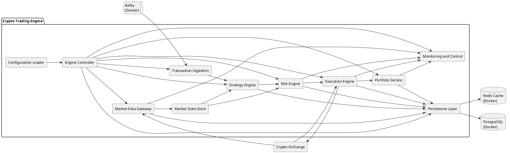
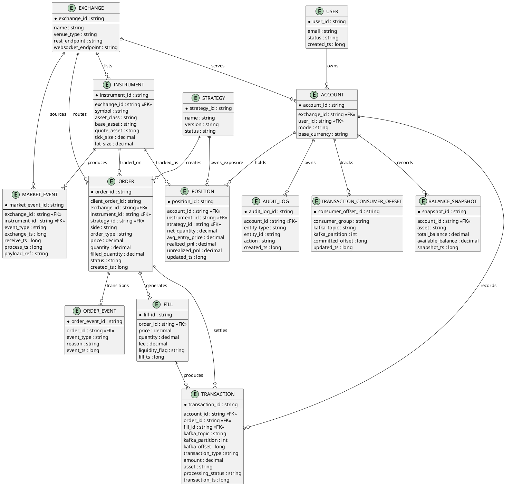
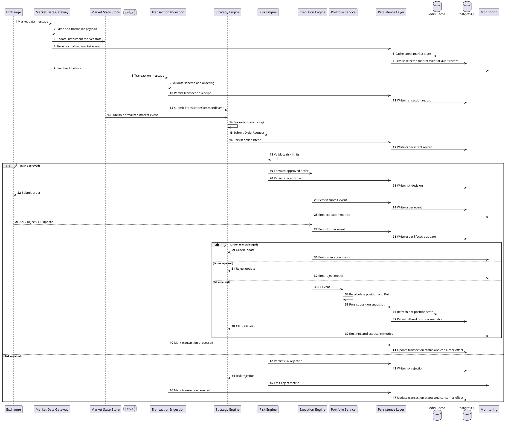

# Crypto Trading Engine UML

## 1. Purpose

This document supplements the main design with UML-style diagrams that describe the planned implementation of the C++ crypto trading engine.

The diagrams are written in PlantUML.

## 2. Component Diagram

This diagram shows the main runtime components and their dependencies.

### Component Notes

- `Configuration Loader` reads startup configuration, risk limits, exchange credentials, and strategy parameters.
- `Engine Controller` wires the system together and owns lifecycle management.
- `Market Data Gateway` handles WebSocket subscriptions and normalizes exchange market payloads.
- `Market State Store` provides the latest in-memory market view for each instrument.
- `Transaction Ingestion` consumes Kafka transaction messages and feeds them into the engine one by one.
- `Strategy Engine` converts market events into order intents.
- `Risk Engine` evaluates intents before any live submission.
- `Execution Engine` maps approved intents to exchange API commands and tracks order lifecycle.
- `Portfolio Service` updates positions, balances, and PnL from fills and snapshots.
- `Persistence Layer` coordinates Redis cache writes and PostgreSQL durable writes.
- `Monitoring and Control` exposes metrics, health checks, and kill-switch controls.
- `Redis Cache` stores hot market and runtime state with low latency.
- `PostgreSQL` stores durable business entities and transaction history.
- `Kafka` is the ingress queue for transaction messages to be processed sequentially.

## 3. ER Diagram

This ER diagram models the core durable entities stored in PostgreSQL for trading, recovery, and replay.

### ER Notes

- The ER model represents PostgreSQL durable storage.
- `MARKET_EVENT` is stored so the engine can replay normalized input rather than depend on raw exchange payloads alone.
- `ORDER_EVENT` captures the order state machine as an append-only history.
- `POSITION` is the current derived state, while `FILL` and `ORDER_EVENT` form the event history behind it.
- `ACCOUNT` is included so the design can later support multiple accounts or modes without redesigning storage.
- Redis is intentionally excluded from the ER model because it is used as a cache rather than the durable system of record.
- Kafka is represented through durable transaction metadata and consumer offset tracking stored in PostgreSQL.

## 4. Sequence Diagram

This sequence diagram shows the main runtime flow from market data receipt to order fill and portfolio update.

## 5. Implementation Mapping

The diagrams map directly to the planned code modules:

- `Component Diagram` maps to `core`, `market_data`, `strategy`, `risk`, `execution`, `portfolio`, `storage`, and `monitoring`.
- `ER Diagram` maps to persisted domain state and replay/recovery support.
- `Sequence Diagram` maps to the event-driven runtime behavior that the engine loop and adapters must implement.

## 6. Planned Deliverables From This Design

The implementation implied by these diagrams includes:

- Core domain models for instruments, market events, orders, fills, positions, and balances.
- A normalized event pipeline from market data ingestion to strategy and risk evaluation.
- An order state machine with durable event history.
- A portfolio accounting subsystem driven by fills.
- Persistent logs and snapshots to support replay and recovery.
- Monitoring hooks for connectivity, risk, execution, and PnL visibility.
